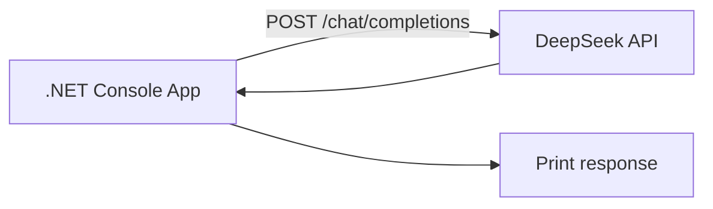
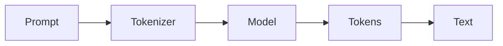
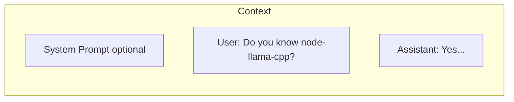
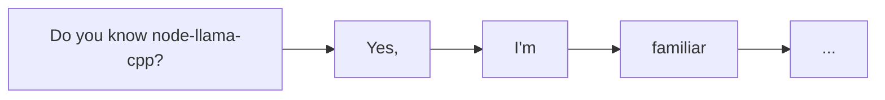
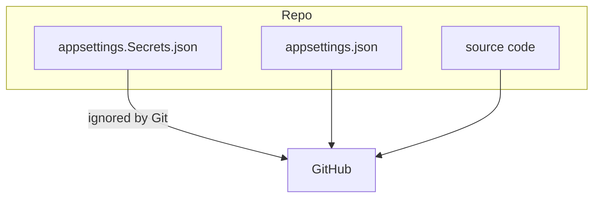

# Concept: Basic LLM Interaction

## Overview

This example introduces the fundamental idea of working with a Large Language Model (LLM): you send it a message and it sends text back. In this version we use the **DeepSeek API**, an OpenAI-compatible hosted service, accessed from .NET 10.

## Core Components

### 1. The Request/Response Flow



### 2. The Inference Pipeline



- **Prompt**: the text you send.
- **Tokenizer**: splits text into tokens.
- **Model**: predicts the next token, repeatedly, until a stop condition is reached.
- **Response**: the generated tokens are decoded back into text.

### 3. Context Window

The context is the model's working memory during a single request:



- Context size is limited (e.g., 64K tokens for `deepseek-v4-flash`).
- Longer requests cost more and take longer.

## How LLMs Generate Responses

Token-by-token generation:



The model predicts one token at a time, then feeds that token back into itself to predict the next.

## Key Concepts for AI Agents

### 1. Stateless Processing
- Each API request is independent.
- The model does not remember previous requests unless you include the conversation history in the message list.
- To build an agent you must maintain state, add tools, and apply reasoning patterns.

### 2. Prompt Engineering Basics

```
❌ Poor: "node-llama-cpp"
✅ Better: "Do you know node-llama-cpp?"
✅ Best: "Explain what node-llama-cpp is and how it works."
```

### 3. Configuration and Secrets



Keep secrets in `appsettings.Secrets.json`, which is listed in `.gitignore`.

## Why This Matters for Agents

1. **Agents need LLMs to "think"**: the model turns input into useful output.
2. **Agents need context**: history, tools, and memory are built on top of this basic call.
3. **Agents need structure**: later examples add system prompts, tools, memory, and reasoning loops.

## Next Steps

- **System prompts**: Give the model a role or behavior.
- **Function calling**: Let the model invoke tools.
- **Memory**: Persist information across sessions.
- **Reasoning patterns**: ReAct, Chain of Thought, Tree of Thought, etc.
