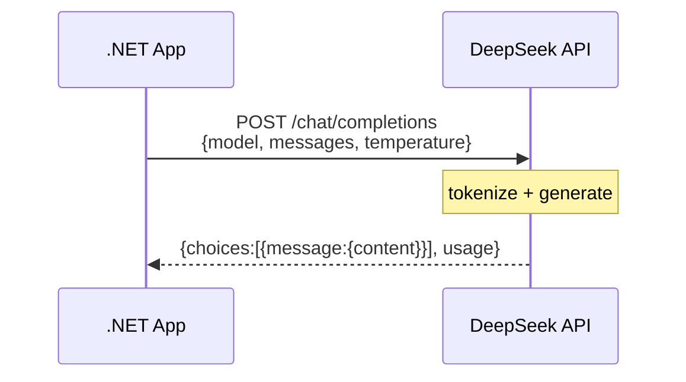
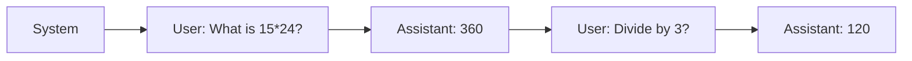
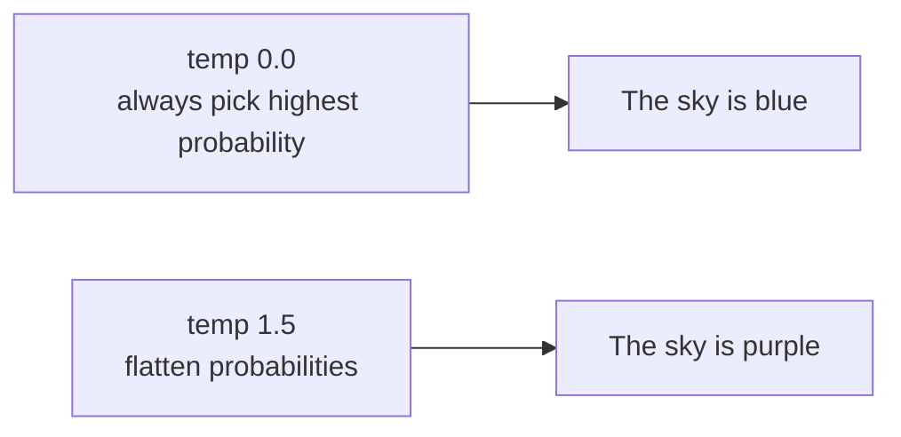
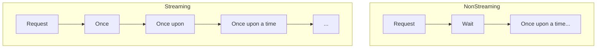
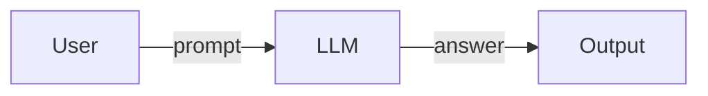
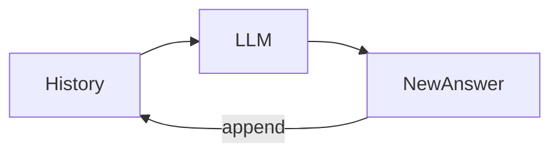
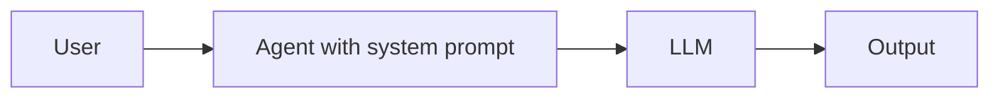

# Concepts: Chapter 02 — Working with the DeepSeek API

This guide explains the fundamental ideas behind calling a hosted LLM from .NET 10.

## What is the DeepSeek API?

The DeepSeek API gives programmatic access to models such as `deepseek-v4-flash` and `deepseek-v4-pro`. It uses an OpenAI-compatible request format, so the official `OpenAI` .NET SDK works with only a base-URL change.

**Key characteristics:**
- **Cloud-based:** Models run on DeepSeek's infrastructure.
- **Pay-per-use:** Charged by token consumption.
- **No local hardware needed:** No GPU or multi-gigabyte model downloads.

## Request-Response Cycle



**Key point:** Each request is independent. The API does not store conversation history.

## Message Roles

### System

Sets behavior, tone, and constraints.

```csharp
ChatMessage.CreateSystemMessage("You are an expert Python tutor.")
```

### User

The human input.

```csharp
ChatMessage.CreateUserMessage("How do I use async/await?")
```

### Assistant

A previous model response, included to provide context.

```csharp
ChatMessage.CreateAssistantMessage("Async/await simplifies asynchronous code...")
```

**Conversation flow:**



## Statelessness

The model does not remember previous requests. To keep context, you must resend the full message history:

```csharp
var messages = new List<ChatMessage>();
messages.Add(ChatMessage.CreateUserMessage("My name is Alice"));

var response1 = await client.CompleteChatAsync(messages);
messages.Add(ChatMessage.CreateAssistantMessage(response1.Value.Content[0].Text));

messages.Add(ChatMessage.CreateUserMessage("What's my name?"));
var response2 = await client.CompleteChatAsync(messages);
```

## Temperature

Controls randomness during token sampling.

| Temperature | Behavior | Best for |
|-------------|----------|----------|
| 0.0 – 0.3 | Deterministic, focused | Code, extraction, facts |
| 0.5 – 0.9 | Balanced | Chat, summarization |
| 1.0 – 2.0 | Creative, varied | Brainstorming, stories |



## Streaming

Non-streaming returns the whole response at once. Streaming yields tokens as they are generated:



Use streaming for interactive chat and non-streaming for batch scripts.

## Tokens

Tokens are the model's basic text units.

- **Cost** is per input + output token.
- **Context limits** vary by model.
- **Response length** can be capped with `MaxOutputTokenCount`.

## Model Selection

| Model | Best for | Cost | Speed |
|-------|----------|------|-------|
| `deepseek-v4-flash` | General tasks, fast answers | Low | Fast |
| `deepseek-v4-pro` | Complex reasoning, coding | Higher | Slower |

## Error Handling

Common HTTP statuses from the DeepSeek API:

- **401** — Invalid or missing API key.
- **429** — Rate limit; retry with backoff.
- **400** — Context length exceeded or bad parameters.
- **500** — Transient service error; retry.

Wrap calls in `try/catch`, implement retries, and monitor token usage.

## Architectural Patterns

### Simple Request-Response



### Stateful Conversation



### Specialized Agent



## Key Insights

1. **Statelessness is power and burden** — you control context, but you must manage it.
2. **System prompts shape behavior** — the same model can act like different agents.
3. **Temperature changes everything** — match it to the task.
4. **Tokens are the real currency** — monitor usage.
5. **Streaming improves UX** — use it for user-facing apps.
6. **Error handling is not optional** — networks fail.

## Further Reading

- [DeepSeek API Docs](https://api-docs.deepseek.com/)
- [OpenAI .NET SDK on NuGet](https://www.nuget.org/packages/OpenAI/)
