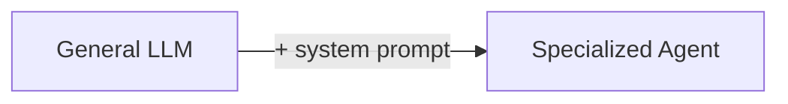

# Code Explanation: Chapter 03 — Translation with System Prompts

This example shows how a **system prompt** turns a general-purpose LLM into a specialized German scientific translator.

> **Source code:** `src/Chapter03/Program.cs`
> **Run:** `dotnet run --project src/Chapter03`

## Setup

```csharp
var config = ConfigurationFactory.Create();
var chatClient = DeepSeekClientFactory.CreateChatClient(config);
```

The client points at the DeepSeek API and uses the model configured in `appsettings.json` (`deepseek-v4-flash` by default).

## The System Prompt

```csharp
const string systemPrompt = """
    Du bist ein erfahrener wissenschaftlicher Übersetzer ...
    DO NOT add any additional text or explanation. ONLY respond with the translated text.
    """;
```

A system prompt sits at the top of the message list and shapes every response. This one defines:

1. **Role**: experienced scientific translator (English → German).
2. **Task**: produce an exact, technically precise translation.
3. **Rules**: idiomatic German, correct terminology, German typography, no literal structures, neutral style.
4. **Output constraint**: return *only* the translation, no commentary.

## The User Prompt

```csharp
const string userPrompt = """
    Translate this text into German:

    We address the long-horizon gap ...
    """;
```

The user message provides the source text to translate.

## Sending the Request

```csharp
var messages = new List<ChatMessage>
{
    ChatMessage.CreateSystemMessage(systemPrompt),
    ChatMessage.CreateUserMessage(userPrompt)
};

var response = await chatClient.CompleteChatAsync(messages);
Console.WriteLine("AI: " + response.Value.Content[0].Text);
```

- Order matters: system first, then user.
- The model applies the system-prompt rules to the user request.
- The response should contain only the German translation.

## Key Concepts

### System Prompts Create Specialized Agents



### Detailed Instructions Beat Minimal Ones

**❌ Minimal:**
```csharp
ChatMessage.CreateSystemMessage("Translate to German")
```

**✅ Detailed:**
```csharp
ChatMessage.CreateSystemMessage("""
    You are a professional scientific translator...
    - Preserve technical accuracy
    - Use idiomatic German
    - ONLY output the translated text
    """)
```

Detailed instructions dramatically improve consistency and output format.

## Experiment Ideas

1. Swap the model in `appsettings.json` to `deepseek-v4-pro` and compare quality.
2. Remove individual rules from the system prompt and observe changes.
3. Try a different source domain (legal, medical, marketing).
4. Change the target language by updating the system prompt.
