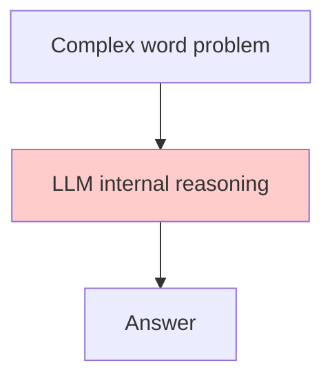

# Code Explanation: Chapter 04 — Think / Reasoning

This example turns the model into a **reasoning agent** for a complex word problem. A strict system prompt forces a single numeric answer.

> **Source code:** `src/Chapter04/Program.cs`
> **Run:** `dotnet run --project src/Chapter04`

## Setup

```csharp
var config = ConfigurationFactory.Create();
var chatClient = DeepSeekClientFactory.CreateChatClient(config);
```

## System Prompt

```csharp
const string systemPrompt = """
    You are an expert logical and quantitative reasoner.
    ...
    Return the correct final number as a single value - no explanation, no reasoning steps, just the answer.
    """;
```

The prompt has three parts:

1. **Role**: expert logical/quantitative reasoner.
2. **Task**: analyze word problems and compute the exact answer.
3. **Output constraint**: return only the final number.

## User Prompt

The family-reunion potato problem requires:

- Counting adults and children across a complex family tree.
- Handling exceptions (deceased relatives, non-eating cousins).
- Computing total potatoes: `(adults × 1.5) + (eating kids × 0.5)`.
- Converting potatoes to pounds (`× 0.5`) and then to 5-pound bags (round up).

## Execution

```csharp
var messages = new List<ChatMessage>
{
    ChatMessage.CreateSystemMessage(systemPrompt),
    ChatMessage.CreateUserMessage(userPrompt)
};

var response = await chatClient.CompleteChatAsync(messages);
Console.WriteLine("AI: " + response.Value.Content[0].Text);
```

## Key Concepts

### Output Format Control

Without the constraint, the model might explain its reasoning. With the constraint, you get just the answer:

```
AI: 3
```

### Limitations of Pure LLM Reasoning



The model has no calculator, no working memory, and no verification. This makes it prone to counting and arithmetic errors.

### Evolution Path


Later chapters add tools and explicit reasoning loops to improve accuracy.

## Experiment Ideas

1. Change the system prompt to ask for step-by-step reasoning and compare accuracy.
2. Give the model a calculator tool (Chapter 07).
3. Ask the same question multiple times and check consistency.
