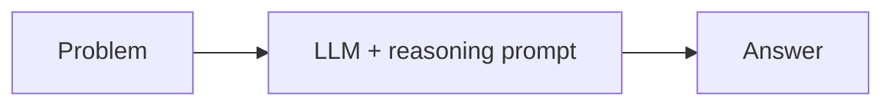
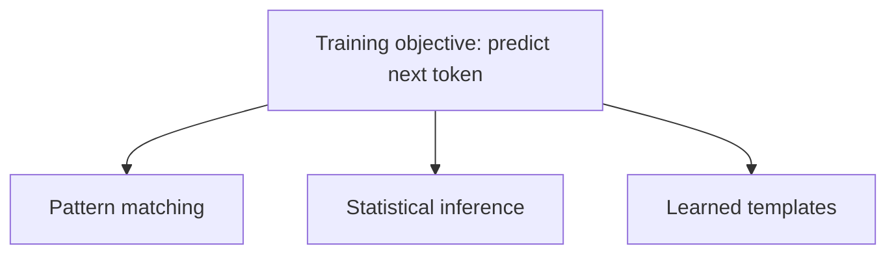
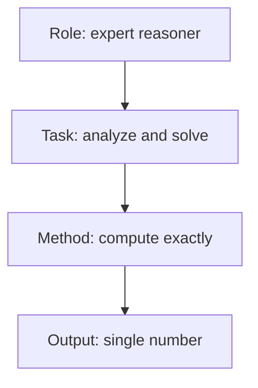
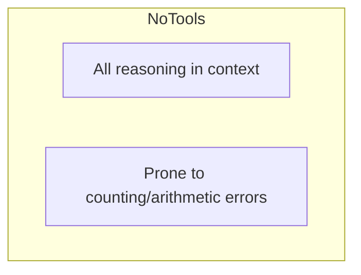

# Concept: Reasoning & Problem-Solving Agents

## Overview

This example configures an LLM as a **reasoning agent** for analytical and quantitative tasks. The goal is not conversation — it is computation and logical deduction.

## What is a Reasoning Agent?

A reasoning agent is an LLM instructed to analyze information, decompose problems, and produce answers through careful prompting.

## Why Reasoning is Hard for LLMs

LLMs are trained to predict text, not to reason explicitly:

They can *mimic* reasoning but do not guarantee correctness.

## The Reasoning Process

## System Prompt Design for Reasoning

## Reasoning Levels

This potato problem is hard: family relationships, exceptions, and unit conversions.

## Limitations

Common failure modes:

- Off-by-one counting errors.
- Arithmetic mistakes in intermediate steps.
- Forgetting constraints (e.g., non-eating cousins).

## Evolution Path

| Level | Pattern | Tools | Visibility |
|-------|---------|-------|------------|
| 1 | Direct answer | None | Hidden |
| 2 | Chain-of-thought | None | Visible |
| 3 | Tool-augmented | Calculator | Verifiable |
| 4 | ReAct loop | Multiple + observations | Self-correcting |

## Key Takeaways

1. System prompts can prime an LLM for reasoning.
2. Pure LLM reasoning is unreliable for complex math.
3. Output constraints produce concise answers.
4. Tools and explicit reasoning loops improve accuracy.
5. Transparency (showing work) makes errors easier to catch.
