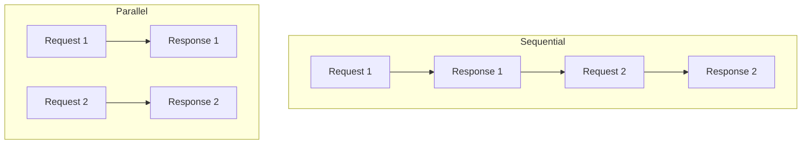

# Code Explanation: Chapter 05 — Batch / Parallel Processing

This example demonstrates how to run multiple independent LLM requests concurrently in .NET using `Task.WhenAll`.

> **Source code:** `src/Chapter05/Program.cs`
> **Run:** `dotnet run --project src/Chapter05`

## Setup

```csharp
var config = ConfigurationFactory.Create();
var chatClient = DeepSeekClientFactory.CreateChatClient(config);
```

## Defining Independent Requests

```csharp
const string q1 = "Hi there, how are you?";
const string q2 = "How much is 6 + 6?";
```

## Running in Parallel

```csharp
var task1 = chatClient.CompleteChatAsync(new List<ChatMessage> { ChatMessage.CreateUserMessage(q1) });
var task2 = chatClient.CompleteChatAsync(new List<ChatMessage> { ChatMessage.CreateUserMessage(q2) });

var results = await Task.WhenAll(task1, task2);
```

- Both `CompleteChatAsync` calls start immediately.
- `Task.WhenAll` waits for both to finish.
- Total time is roughly the slowest request, not the sum.

## Sequential vs Parallel



## Displaying Results

```csharp
Console.WriteLine("User: " + q1);
Console.WriteLine("AI: " + results[0].Value.Content[0].Text);

Console.WriteLine("\nUser: " + q2);
Console.WriteLine("AI: " + results[1].Value.Content[0].Text);
```

## Key Concepts

### Task.WhenAll

In .NET, `Task.WhenAll` is the equivalent of JavaScript's `Promise.all`. It is the idiomatic way to run independent async operations concurrently.

### Independence Matters

Parallelism only helps when requests do not depend on each other. A multi-turn conversation must still be sequential.

### Use Cases

- Multi-user chat backends.
- Batch evaluation of prompts.
- A/B testing system prompts.
- Multi-agent systems where agents work on separate subtasks.

## Experiment Ideas

1. Add a third or fourth parallel request.
2. Time the total duration and compare with sequential execution.
3. Handle exceptions so one failed request does not crash the batch.
