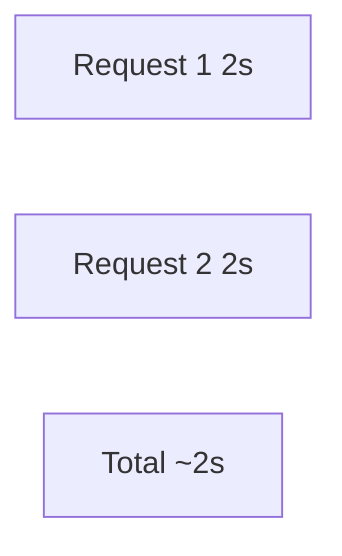
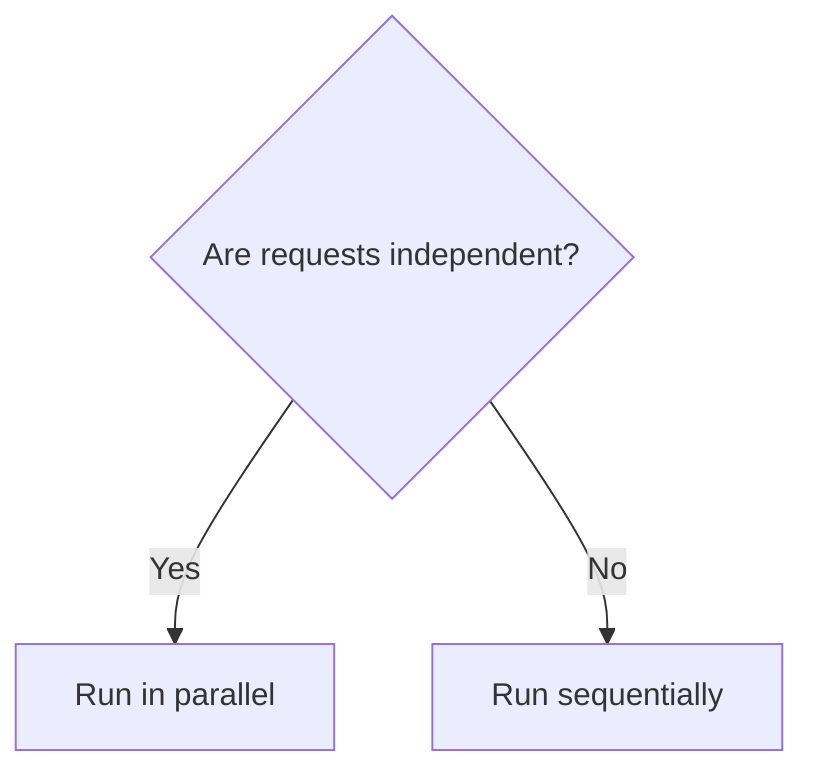

# Concept: Parallel Processing & Performance Optimization

## Overview

This example shows how to execute multiple independent LLM requests at the same time, a critical technique for scalable agent systems.

## The Performance Problem

### Sequential Processing

### Parallel Processing

Both requests run simultaneously, so total time is close to the slowest individual request.

## .NET Concurrency Primitives

| JavaScript | .NET |
|------------|------|
| `Promise.all([...])` | `Task.WhenAll([...])` |
| `await` | `await` |
| `async function` | `async Task` |

## When Parallelism Helps

Good fits:

- Separate user conversations.
- Independent analysis tasks.
- A/B tests of prompts or models.

Poor fits:

- Multi-turn chats that build on previous answers.
- Dependent reasoning steps (use ReAct instead).

## Real-World Scenarios

| Scenario | Sequential | Parallel (n tasks) |
|----------|------------|-------------------|
| 100 users, 2s each | 200s | ~2s (if fully parallel) |
| Batch analyze 1000 docs | 50 min | ~6 min (8 at a time) |

## Limitations

- **Rate limits**: APIs often throttle concurrent requests.
- **Cost**: Parallel calls happen at the same time, so budget matters.
- **Dependencies**: Must not be used when order matters.

## Key Takeaways

1. Use `Task.WhenAll` for independent async work in .NET.
2. Parallel requests reduce total latency.
3. Only parallelize independent tasks.
4. Respect API rate limits and quotas.
5. Handle exceptions so one failure does not break the whole batch.
