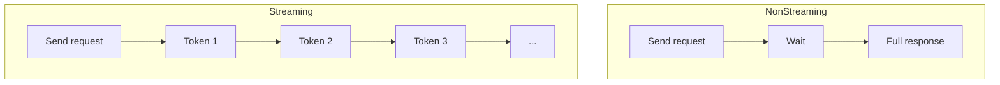

# Code Explanation: Chapter 06 — Coding / Streaming & Response Control

This example demonstrates **streaming responses** and **token limits** using the DeepSeek API from .NET 10.

> **Source code:** `src/Chapter06/Program.cs`
> **Run:** `dotnet run --project src/Chapter06`

## Setup

```csharp
var config = ConfigurationFactory.Create();
var chatClient = DeepSeekClientFactory.CreateChatClient(config);
```

## Streaming Execution

```csharp
var options = new ChatCompletionOptions
{
    MaxOutputTokenCount = 2000
};

await foreach (var update in chatClient.CompleteChatStreamingAsync(messages, options))
{
    foreach (var part in update.ContentUpdate)
    {
        Console.Write(part.Text);
        fullResponse.Append(part.Text);
    }
}
```

- `CompleteChatStreamingAsync` returns `IAsyncEnumerable<StreamingChatCompletionUpdate>`.
- Each `update` contains one or more `ContentUpdate` text parts.
- `Console.Write` prints the text as it arrives, producing a live "typing" effect.
- `StringBuilder` accumulates the full response for logging or further processing.

## Token Limits

```csharp
new ChatCompletionOptions { MaxOutputTokenCount = 2000 }
```

- Caps the response length to 2000 tokens.
- Prevents runaway generation.
- Makes cost and latency more predictable.

## Streaming vs Non-Streaming



## Key Concepts

### `IAsyncEnumerable<T>`

In .NET, streaming APIs commonly return `IAsyncEnumerable<T>`. You consume it with `await foreach`:

```csharp
await foreach (var update in stream)
{
    // process update
}
```

### Buffering

The example buffers the full response in a `StringBuilder` while printing partial output. This pattern is useful when you need both live display and the final text.

### Use Cases

- Interactive chat interfaces.
- Server-Sent Events (SSE) in web apps.
- Logging partial outputs.
- Early termination if the response goes off track.

## Experiment Ideas

1. Change `MaxOutputTokenCount` to 100 and see how the response is cut.
2. Stream to a file instead of the console.
3. Count tokens per second using a `Stopwatch`.
