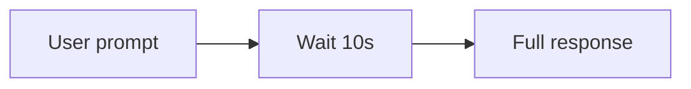
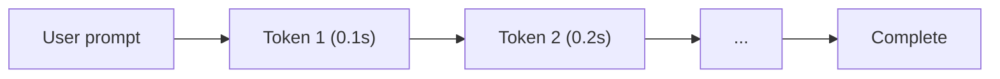
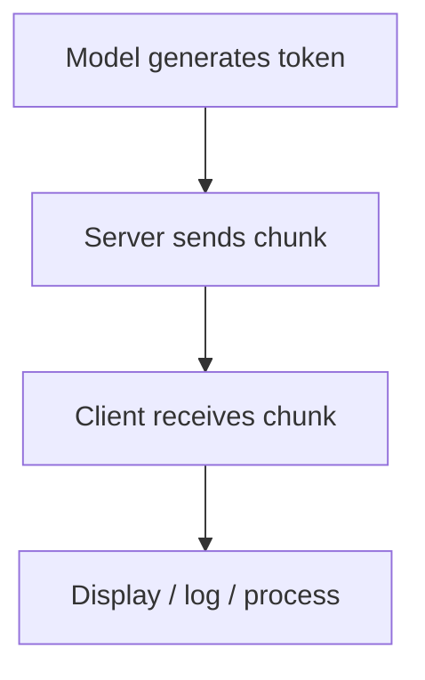
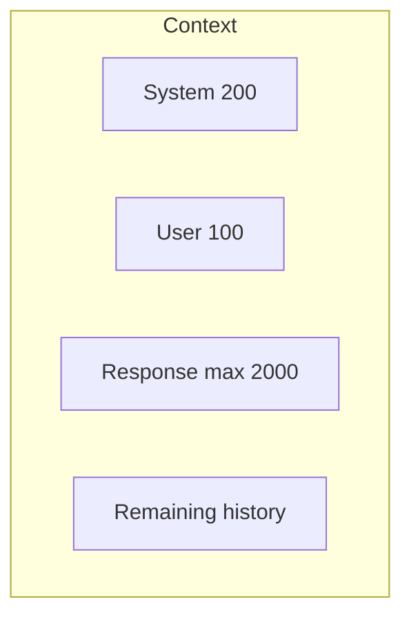

# Concept: Streaming & Response Control

## Overview

This example covers **streaming responses** and **token limits**, two techniques essential for responsive and cost-controlled agent interfaces.

## The Streaming Problem

### Non-Streaming



### Streaming



Streaming gives immediate feedback and improves perceived performance.

## How Streaming Works



The model still generates one token at a time; streaming exposes each chunk as it is produced.

## Token Limits



Limiting output:

- Prevents overly long responses.
- Controls cost.
- Keeps latency predictable.

## .NET Streaming Pattern

```csharp
await foreach (var update in chatClient.CompleteChatStreamingAsync(messages, options))
{
    foreach (var part in update.ContentUpdate)
    {
        Console.Write(part.Text);
    }
}
```

## Buffering Strategies

| Strategy | Behavior | Use Case |
|----------|----------|----------|
| Immediate | Every token → display | Smoothest UX |
| Line | Buffer until newline | Paragraph output |
| Time | Buffer 50ms then flush | Reduce callback frequency |

## Best Practices

1. Set `MaxOutputTokenCount` for predictable responses.
2. Use `StringBuilder` to accumulate while streaming.
3. Handle completion/cancellation gracefully.
4. Monitor time-to-first-token and throughput.

## Key Takeaways

1. Streaming improves UX in user-facing applications.
2. `IAsyncEnumerable<T>` is the idiomatic .NET streaming API.
3. Token limits control cost and response length.
4. Buffering strategies balance smoothness and overhead.
5. Streaming is essential for production chat interfaces.
