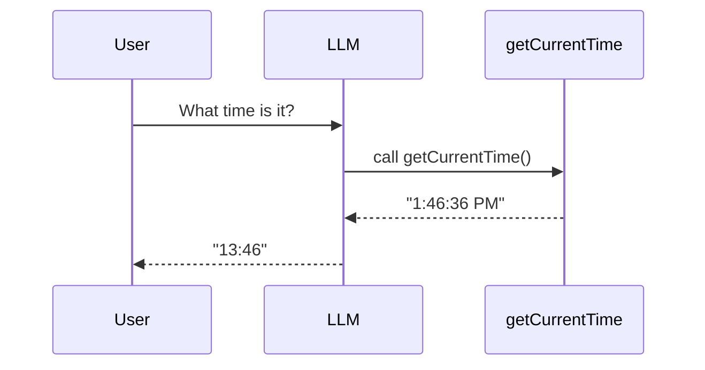

# Code Explanation: Chapter 07 — Simple Agent (Tools)

This example demonstrates **function calling**, the feature that transforms an LLM from a text generator into an agent that can take actions.

> **Source code:** `src/Chapter07/Program.cs`
> **Run:** `dotnet run --project src/Chapter07`

## Setup

```csharp
var config = ConfigurationFactory.Create();
var chatClient = DeepSeekClientFactory.CreateChatClient(config);
```

## System Prompt

```csharp
const string systemPrompt = """
    You are a professional chronologist ...
    Always convert times from 12-hour format ... to 24-hour format ... without seconds
    """;
```

The system prompt defines the agent's role and output format.

## Defining a Tool

```csharp
toolbox.Add(new AgentTool(
    name: "getCurrentTime",
    description: "Get the current time",
    parametersSchema: new { type = "object", properties = new { }, required = Array.Empty<string>() },
    handler: async _ => DateTime.Now.ToString("h:mm:ss tt")
));
```

- `name`: the function identifier.
- `description`: tells the LLM when to use it.
- `parametersSchema`: JSON Schema for arguments.
- `handler`: async C# code that runs when the LLM calls the tool.

## The Tool-Calling Loop

```csharp
var options = toolbox.CreateOptions();
var response = await chatClient.CompleteChatAsync(messages, options);

while (await toolbox.HandleToolCallsAsync(response.Value, messages))
{
    response = await chatClient.CompleteChatAsync(messages, options);
}

Console.WriteLine("AI: " + response.Value.Content[0].Text);
```

What happens:

1. The LLM sees the tool description.
2. It decides to call `getCurrentTime`.
3. `ToolBox.HandleToolCallsAsync` executes the handler and appends the result.
4. The conversation is sent again with the tool result.
5. The LLM produces the final answer in 24-hour format.



## Debugging

```csharp
var debugger = new PromptDebugger(outputDir: "./logs", filename: "qwen_prompts");
debugger.Log(messages, toolbox.Tools);
```

This writes the full prompt (messages + tool schemas) to `logs/qwen_prompts_[timestamp].txt`.

## Key Concepts

- **Function calling**: LLM decides when to invoke code.
- **JSON Schema**: describes tool parameters.
- **Tool result message**: feeds the handler output back to the LLM.
- **Loop**: multiple tool calls may be needed; loop until no more tool calls.

## Experiment Ideas

1. Add a `getCurrentDate` tool.
2. Change the system prompt to request a different format.
3. Introduce an intentional error in the handler and see how the LLM responds.
