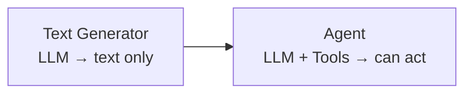
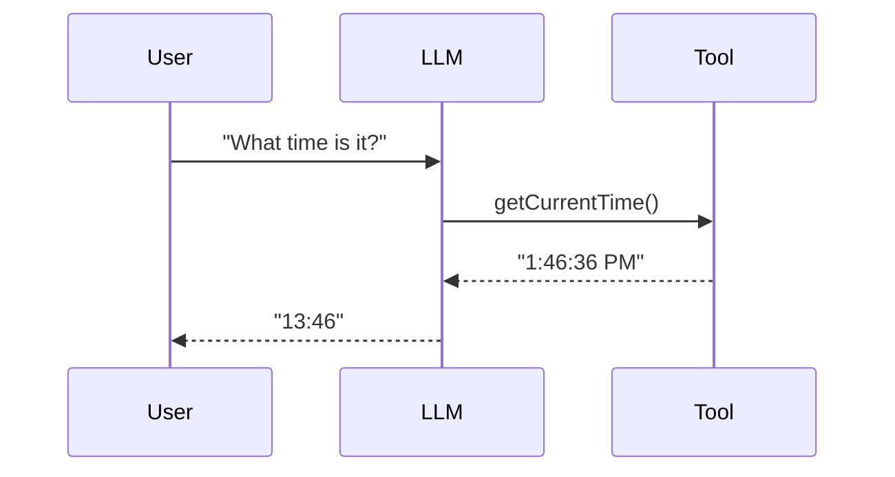
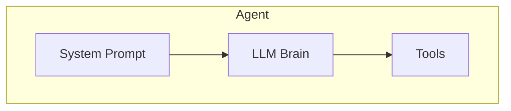

# Concept: Function Calling & Tool Use

## Overview

Function calling transforms an LLM from a text generator into an **agent** that can take actions and interact with the world.

## What Makes an Agent?

## How It Works

## Agent = LLM + System Prompt + Tools

## Tool Definition Anatomy

| Field | Purpose |
|-------|---------|
| `name` | Identifier used in code |
| `description` | Helps the LLM decide when to call it |
| `parametersSchema` | JSON Schema for arguments |
| `handler` | C# code that executes the tool |

## Real-World Applications

- **Personal assistant**: calendar, reminders, email.
- **Research agent**: web search, document reading.
- **Coding assistant**: run code, check errors.
- **Data analyst**: query databases, compute statistics.

When you have many tools, sending the full catalog on every turn wastes context. Chapter 15 shows how to route tools using embeddings.

## Key Takeaway

Function calling is the feature that enables AI agents. Without it, LLMs can only talk. With it, they can act.
