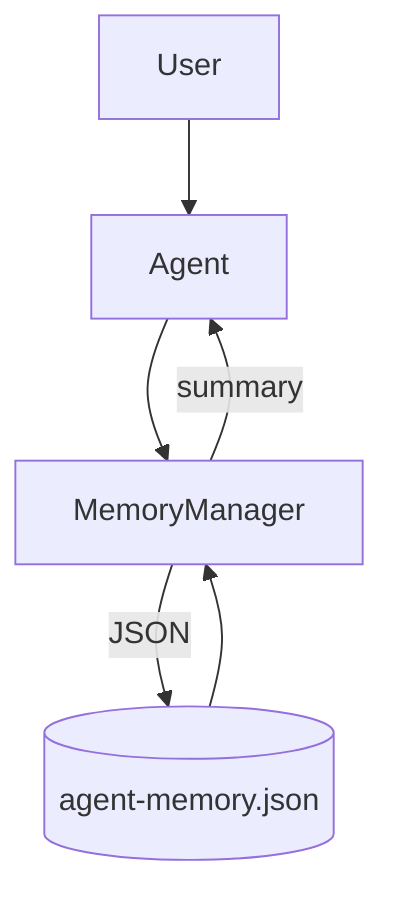

# Code Explanation: Chapter 08 — Simple Agent with Memory

This example adds **persistent memory** to the simple agent. The agent can remember facts and preferences across sessions.

> **Source code:** `src/Chapter08/Program.cs`
> **Run:** `dotnet run --project src/Chapter08`

## Memory Manager

The `MemoryManager` class lives in `AiAgents.Core.Memory` and handles JSON persistence:

```csharp
var memoryManager = new MemoryManager("./agent-memory.json");
var memorySummary = memoryManager.GetMemorySummary();
```

- `Load()` reads memories from disk.
- `Save()` writes memories back.
- `AddMemory(type, key, value)` adds or updates an entry, skipping exact duplicates.
- `GetMemorySummary()` formats memories for injection into the system prompt.

## Memory Storage Format

```json
{
  "memories": [
    {
      "type": "fact",
      "key": "user_name",
      "value": "Alex",
      "source": "user",
      "timestamp": "2026-06-14T08:50:00Z"
    }
  ]
}
```

## System Prompt

The system prompt includes existing memories so the agent can recall them. It also instructs the agent not to save duplicates.

## saveMemory Tool

```csharp
toolbox.Add(new AgentTool(
    name: "saveMemory",
    description: "Save important information to long-term memory",
    parametersSchema: new
    {
        type = "object",
        properties = new
        {
            type = new { type = "string", @enum = new[] { "fact", "preference" } },
            key = new { type = "string" },
            value = new { type = "string" }
        },
        required = new[] { "type", "key", "value" }
    },
    handler: async args =>
    {
        memoryManager.AddMemory(
            args.GetProperty("type").GetString()!,
            args.GetProperty("key").GetString()!,
            args.GetProperty("value").GetString()!);
        return "Memory saved.";
    }
));
```

## Conversation Loop

```csharp
async Task<string> AskAsync(string prompt)
{
    messages.Add(ChatMessage.CreateUserMessage(prompt));

    var response = await chatClient.CompleteChatAsync(messages, options);
    while (await toolbox.HandleToolCallsAsync(response.Value, messages))
    {
        response = await chatClient.CompleteChatAsync(messages, options);
    }

    var text = response.Value.Content[0].Text;
    messages.Add(ChatMessage.CreateAssistantMessage(text));
    return text;
}
```

The assistant message is appended so the next question has full context.

## Key Concepts



## Expected Behavior

1. User: "Hi! My name is Alex and I love pizza." → Agent saves two memories.
2. User: "What's my favorite food?" → Agent recalls "pizza" from memory.
3. User: "My name is Alex." → Agent acknowledges without saving.
4. User: "I actually prefer sushi." → Agent updates the existing preference.
