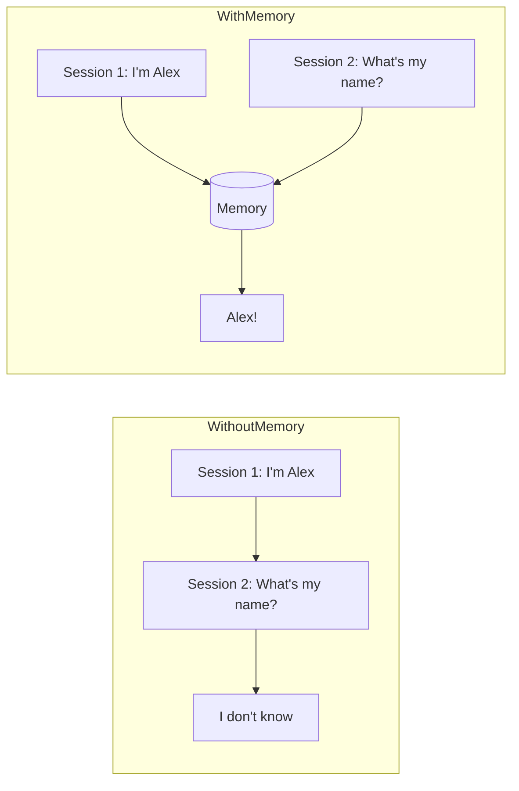
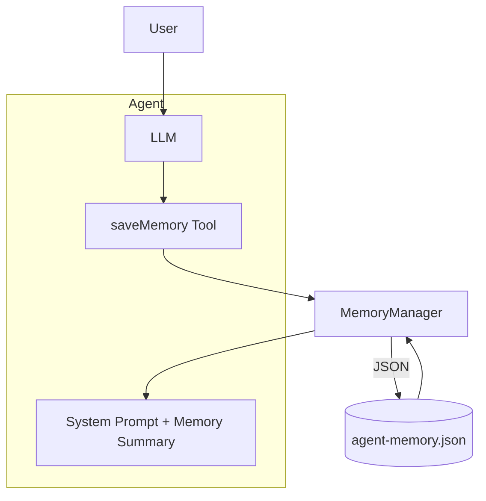
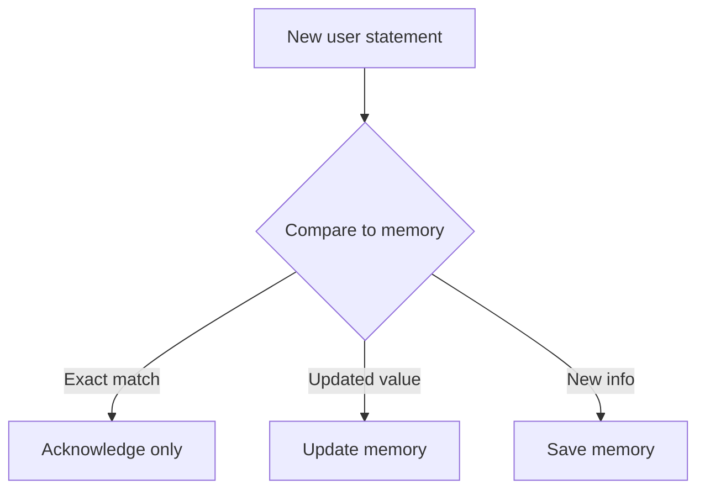

# Concept: Persistent Memory & State Management

## Overview

Persistent memory lets agents remember information across sessions, turning stateless responders into personalized assistants.

## The Memory Problem

## Architecture

## Memory Types

| Type | Example |
|------|---------|
| Fact | "user_name: Alex" |
| Preference | "favorite_food: pizza" |
| Event | "Last discussed: C# async" |

## Duplicate Prevention

## Real-World Applications

- Personal assistants.
- Customer service bots.
- Learning tutors.
- Healthcare trackers.

## Key Takeaways

1. Memory makes agents personalized.
2. Inject a memory summary into the system prompt.
3. Let the agent decide what to save via a tool.
4. Avoid duplicate saves with reasoning instructions.
5. Store memories in a structured, persistent format.
