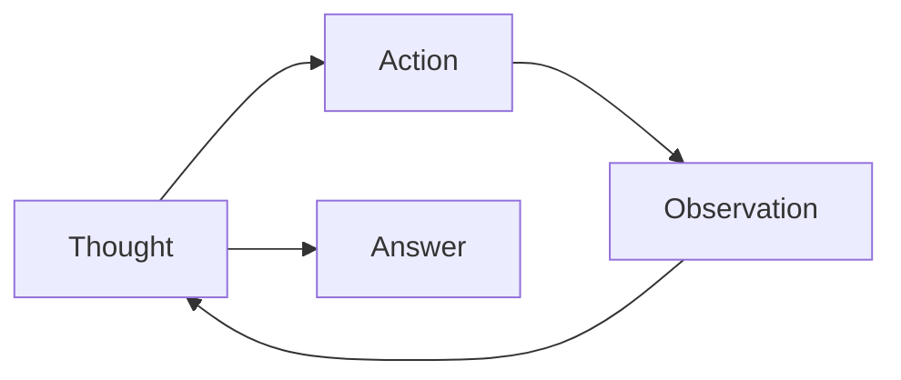

# Code Explanation: Chapter 09 — ReAct Agent

This example implements the **ReAct pattern** (Reasoning + Acting): the agent alternates between thinking, calling a tool, observing the result, and repeating until it reaches a final answer.

> **Source code:** `src/Chapter09/Program.cs`
> **Run:** `dotnet run --project src/Chapter09`

## ReAct System Prompt

```csharp
const string systemPrompt = """
    You are a mathematical assistant that uses the ReAct (Reasoning + Acting) approach.

    CRITICAL: Follow this EXACT pattern:

    Thought: [Explain what calculation you need to do next and why]
    Action: [Call ONE tool with specific numbers]
    Observation: [Wait for the tool result]
    ...
    Thought: [Once you have ALL the information needed]
    Answer: [Give the final answer and STOP]
    """;
```

The system prompt forces the model to show its reasoning and to use tools for every calculation.

## Calculator Tools

Four math tools are registered in a `ToolBox`:

- `add(a, b)`
- `multiply(a, b)`
- `subtract(a, b)`
- `divide(a, b)`

Each handler logs the call and returns the numeric result.

## ReAct Loop

```csharp
for (var iteration = 1; iteration <= maxIterations; iteration++)
{
    var response = await chatClient.CompleteChatAsync(messages, options);
    var text = response.Value.Content[0].Text;
    Console.WriteLine(text);
    messages.Add(ChatMessage.CreateAssistantMessage(text));

    if (text.Contains("Answer:", StringComparison.OrdinalIgnoreCase))
        return; // done

    var hadToolCalls = await toolbox.HandleToolCallsAsync(response.Value, messages);
    if (!hadToolCalls)
        return; // no progress possible
}
```

- The loop runs up to `maxIterations` times.
- Each iteration prints the model's Thought/Action text.
- Tool results are appended as `tool` messages.
- The loop stops when the model emits `Answer:`.

## Example Execution

```
USER QUESTION: A store sells 15 items on Monday at $8 each, 20 on Tuesday at $8 each, 10 on Wednesday at $8 each. What's the average number of items sold per day, and what's the total revenue?

--- Iteration 1 ---
Thought: First I need to calculate revenue for Monday.
Action: multiply(15, 8)

   TOOL CALLED: multiply(15, 8)
   RESULT: 120

Observation: 120
...
Answer: The average is 15 items per day and the total revenue is $280.
```

## Key Concepts



## Why ReAct Works

- **Reliability**: arithmetic is done by code, not the LLM.
- **Transparency**: reasoning is visible.
- **Iterative**: complex problems are broken into small steps.

## Experiment Ideas

1. Change the question to one that needs division or subtraction.
2. Lower `maxIterations` and see what happens.
3. Add a `verify` tool that checks previous results.
