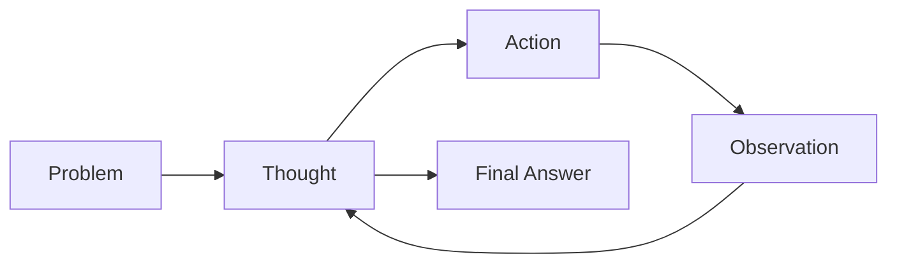
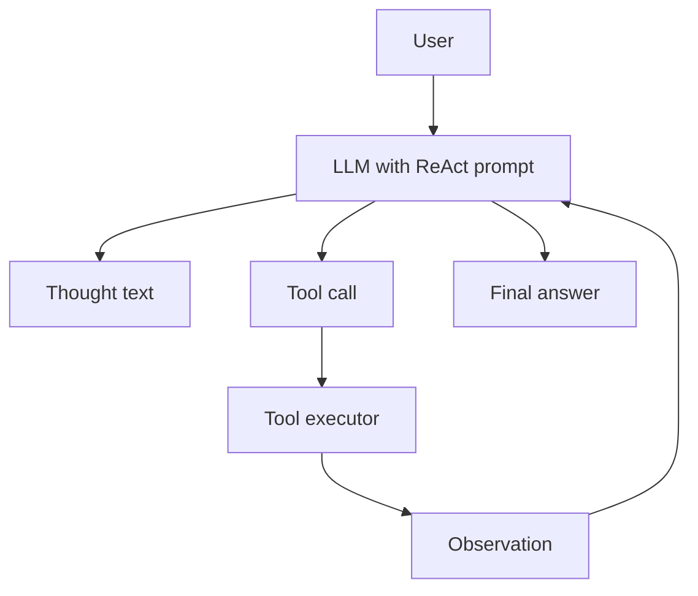

# Concept: ReAct Pattern for AI Agents

## What is ReAct?

**ReAct** = **Rea**soning + **Act**ing. The agent loops through:

1. **Thought** — reason about what to do next.
2. **Action** — call a tool.
3. **Observation** — receive the tool result.
4. Repeat until a final answer is reached.



## Why ReAct Matters

| Problem | Without ReAct | With ReAct |
|---------|---------------|------------|
| Complex calculations | LLM arithmetic errors | Tools compute exactly |
| Multi-step tasks | Loses track | Explicit steps |
| Transparency | Black box | Visible reasoning |
| Self-correction | None | Can retry on bad results |

## Example Trace

```
Thought: First I need to calculate 15 × 8
Action: multiply(15, 8)
Observation: 120

Thought: Now I need to calculate 20 × 8
Action: multiply(20, 8)
Observation: 160

Thought: Now add the results
Action: add(120, 160)
Observation: 280

Thought: I have the final answer
Answer: 280
```

## Architecture



## Implementation Essentials

1. **Clear system prompt** enforcing Thought/Action/Observation/Answer.
2. **Focused tools** that do one thing well.
3. **Iteration limit** to prevent infinite loops.
4. **Answer detection** to stop the loop.

## Key Takeaways

1. ReAct combines reasoning and tool use in a loop.
2. Tools make calculations reliable.
3. Visible reasoning makes debugging easier.
4. This pattern underpins most modern agent frameworks.
