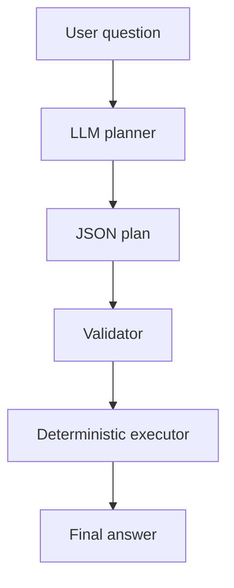

# Concept: Atom of Thought (AoT) Pattern

## Core Idea

**Atom of Thought** breaks reasoning into minimal, executable, validated steps. The LLM only plans; the system validates and executes.



## What is an Atom?

An atom is the smallest unit of reasoning:

- Expresses exactly one operation.
- Can be validated independently.
- Can be executed deterministically.
- Cannot hide a mistake.

## Atom Structure

```json
{
  "id": 2,
  "kind": "tool",
  "name": "multiply",
  "input": { "a": "<result_of_1>", "b": 3 },
  "dependsOn": [1]
}
```

## Dependency Graph

```mermaid
flowchart TB
    A[1: add(15,7)] --> B[2: multiply(result_1, 3)]
    B --> C[3: subtract(result_2, 10)]
    C --> D[4: final]
```

## AoT vs ReAct

| Aspect | ReAct | AoT |
|--------|-------|-----|
| Format | Natural language | Structured JSON |
| Validation | Hard | Before execution |
| Debugging | Trace text | Inspect atom |
| Replay | Entire conversation | Re-run from atom |
| Audit trail | Chat history | Data structure |

## When to Use AoT

✅ Use for:

- Multi-step workflows.
- API orchestration.
- Auditable calculations.
- Compliance-sensitive systems.

❌ Avoid for:

- Single-step tasks.
- Creative or exploratory work.
- Open-ended conversation.

## Key Takeaways

1. AoT makes reasoning explicit and auditable.
2. Separation of plan/validate/execute improves reliability.
3. JSON mode forces structured output.
4. Each atom is a testable, debuggable unit.
