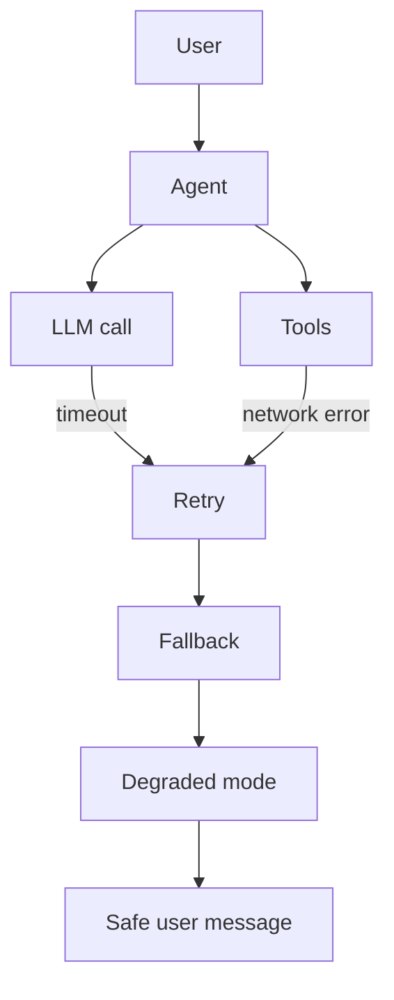
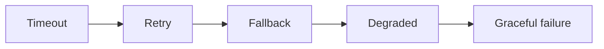

# Concept: Comprehensive Error Handling for Agents

## Why Agents Need Special Error Handling

Agents orchestrate multiple unreliable steps:

- LLM calls can time out or return unusable output.
- Tools can fail transiently or permanently.
- Workflows can hit policy guards or dependency-chain failures.

## Error Taxonomy

| Type | Meaning | Retryable? |
|------|---------|------------|
| `ValidationError` | Bad user input | No |
| `LLMCallError` | Model call failed | Often yes |
| `ToolExecutionError` | Tool failed | Sometimes |
| `AgentWorkflowError` | Orchestration failed | Usually no |

## Recovery Ladder

## Separation of Concerns

- **Users** see safe messages + correlation ID.
- **Operators** see codes, details, and cause chains.

## Key Takeaways

1. Use stable error codes for metrics and alerts.
2. Normalize unknown exceptions before handling.
3. Retry only transient errors with backoff and jitter.
4. Always bound calls with timeouts.
5. Provide deterministic degraded paths.
6. Preserve root causes in `InnerException`.
