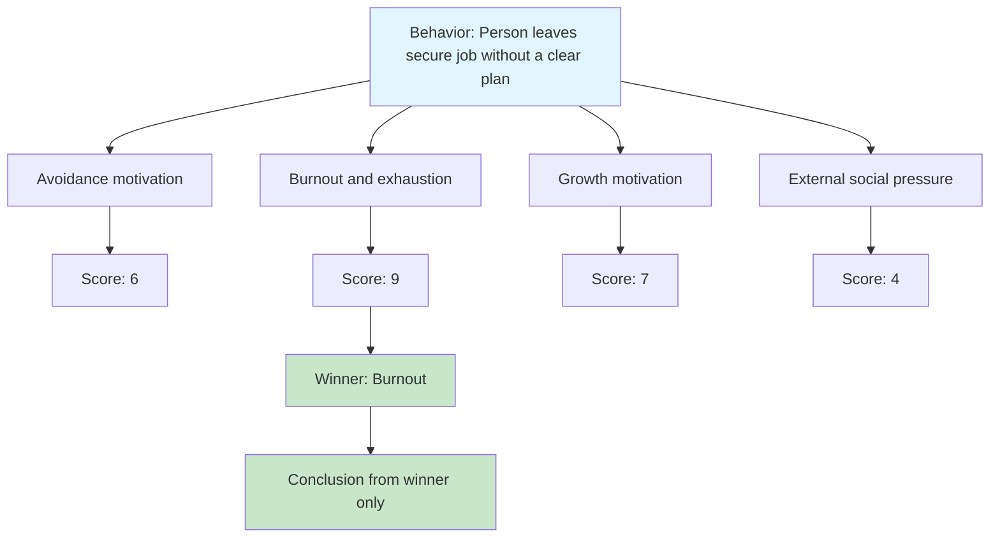

## Tree of Thought: Motivation analysis of a person

**Idea:** A person shows puzzling behavior. The agent explores multiple psychological explanations in parallel, scores them, and expands only the strongest hypothesis into the final analysis.

---

### Visual tree

---

### What Example 12 demonstrates

1. **Branch:** Build four competing psychological hypotheses.
2. **Score:** Evaluate each hypothesis independently.
3. **Prune:** Keep only the highest-scoring branch.
4. **Conclusion:** Produce a final analysis from the winner only.

This intentionally highlights both ToT's strength (structured exploration) and weakness (information loss after pruning).

---

### The three core principles in code

| Principle | What happens in code |
|---|---|
| Branching | `DevelopHypothesisAsync()` creates one hypothesis per lens |
| Evaluation | `ScoreHypothesisAsync()` scores each hypothesis |
| Pruning | `Main()` keeps only `winner` and stores the rest as `discarded` |

---

### Structural downside shown explicitly

At the end, the program prints the discarded branches.  
Those branches may contain corrective insights, but they do not influence the final conclusion anymore.

That is the core limitation of strict ToT pruning.

---

### When to use ToT in real work

Use Tree of Thought when you need a clear winner and a simple decision path.

#### System admin mental model

You get a production alert: API latency jumped from 200 ms to 2 s after a release.

- **Branches:** DB saturation, cache miss storm, or noisy-neighbor network issue.
- **Score:** Each branch gets evidence-based scoring from dashboards and logs.
- **Prune:** Pick the highest-confidence cause (for example cache collapse).
- **Act:** Run one remediation path first (for example emergency cache warmup + TTL rollback).

Why ToT fits: incident response often needs one fast, auditable decision path instead of maintaining many parallel remediation tracks.

#### Developer mental model

You need to speed up a slow endpoint before a launch.

- **Branches:** add Redis caching, rewrite query with better indexes, or precompute data asynchronously.
- **Score:** Evaluate by implementation effort, risk, expected gain, and testability.
- **Prune:** Select one strategy to implement now.
- **Act:** Ship the chosen change and measure.

Why ToT fits: when deadlines are near, teams usually need one implementation winner, not a combined architecture experiment.

#### AI agent creator mental model

You are building an autonomous coding agent that must choose a fix strategy.

- **Branches:** minimal patch, deeper refactor, or rollback + guardrail.
- **Score:** Rank by failure risk, blast radius, and confidence from repo evidence.
- **Prune:** Keep one execution plan.
- **Act:** Execute, verify, and report.

Why ToT fits: you get predictable behavior, lower token/tool cost, and easier postmortems because the agent follows one explicit plan.

ToT is strongest when:

- time is limited,
- the output should be one actionable direction,
- and the cost of keeping many alternatives alive is higher than the risk of losing nuance.
