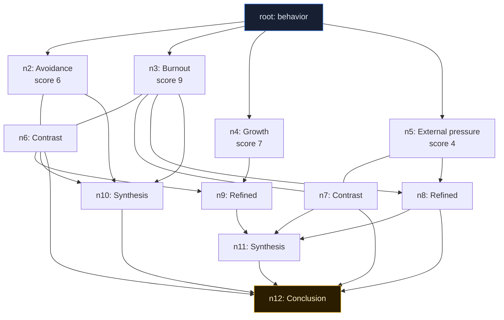

## Graph of Thought: Motivation analysis of a person

Graph of Thought keeps multiple reasoning strands alive and combines them.
Unlike Tree of Thought, weaker branches are not automatically discarded.

---

### Visual graph shape

---

### Why GoT gives a different class of answer

Tree of Thought often picks one winner and drops alternatives.
Graph of Thought does the opposite: it reuses alternatives through graph operations.

In this example:

- **Branch:** Build four competing hypotheses.
- **Score:** Rank them, but keep all in the graph.
- **Contrast:** Turn disagreement into a new diagnostic signal.
- **Refine:** Improve weak branches using strong branches.
- **Aggregate:** Merge multiple sources into syntheses.
- **Conclude:** Use all strands for a final integrated view.

---

### GoT operations and what they unlock

| Operation | What it reveals in this example |
|---|---|
| Contrast | Productive tension between hypotheses becomes explicit evidence |
| Refine | Weak hypotheses are rescued instead of discarded |
| Aggregate | Different strands are synthesized into richer intermediate views |
| Conclude | Final answer includes contradictions and rescued insights |

---

### Core takeaway

Tree of Thought asks: **Which branch wins?**  
Graph of Thought asks: **How can multiple branches interact to produce a better final model?**

That is why GoT can produce answers that are not just "better scoring", but structurally more complete.

---

### When to use GoT in real work

Use Graph of Thought when multiple perspectives must stay connected and influence each other.

#### System admin mental model

A regional outage affects only some users and symptoms conflict across tools.

- **Branches:** network routing issue, database replication lag, or auth-service dependency timeout.
- **Contrast:** Compare branches that disagree (for example "network is healthy" vs "timeouts are network-shaped").
- **Refine:** Update weaker explanations using fresh telemetry and cross-team notes.
- **Aggregate:** Build a combined incident model that includes infra + app interactions.
- **Conclude:** Coordinate a staged mitigation plan that addresses multiple contributing factors.

Why GoT fits: real incidents are often multi-causal, and discarding "weaker" signals too early can hide the true failure chain.

#### Developer mental model

A flaky end-to-end test fails unpredictably in CI but rarely locally.

- **Branches:** race condition, clock skew, test data coupling, or external API nondeterminism.
- **Contrast:** Pair hypotheses against each other using failure traces and timestamps.
- **Refine:** Improve weak hypotheses with strong evidence from logs and reruns.
- **Aggregate:** Build an integrated explanation (for example timing bug + shared fixture contamination).
- **Conclude:** Produce a fix plan that combines code changes, test isolation, and CI environment guards.

Why GoT fits: debugging often needs interaction between hypotheses, not a single winner picked too early.

#### AI agent creator mental model

You are designing a research-grade planning agent for complex tasks (code + docs + infra).

- **Branches:** different task decompositions and tool sequences.
- **Contrast:** Let plans critique each other to expose hidden assumptions.
- **Refine:** Improve weaker plans using strong-plan insights.
- **Aggregate:** Merge complementary subplans into one robust strategy.
- **Conclude:** Execute with richer context and keep traceable reasoning artifacts.

Why GoT fits: agents handling ambiguous, high-stakes tasks benefit from preserving and recombining reasoning rather than pruning early.

GoT is strongest when:

- the problem is ambiguous,
- weaker signals may become valuable after refinement,
- and you want a final answer that preserves contradictions instead of hiding them.
