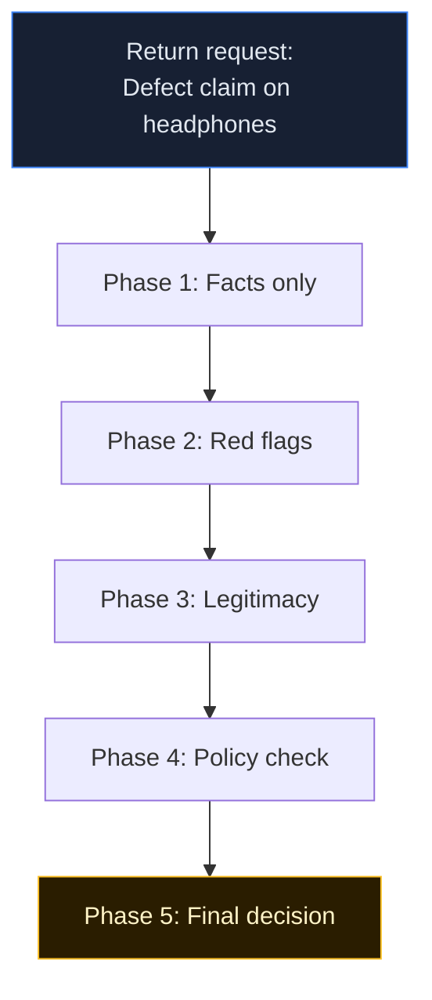

## Chain of Thought: Return decision (fraud vs legitimate)

**Idea:** A customer requests a return. Instead of letting the model jump directly to "approve/reject", it must write an explicit reasoning chain like a support agent documenting a case for a supervisor.

---

### Visual chain

---

### What Example 14 demonstrates

1. **Facts:** Extract data only, no early judgment.
2. **Red Flags:** Run explicit fraud screening checkpoint-by-checkpoint.
3. **Legitimacy:** Build the customer-side case as a balancing force.
4. **Policy Check:** Apply rules (window, value, history) before deciding.
5. **Decision:** Decide only after all prior phases are complete.

This structure makes the decision auditable and debuggable.

---

### Why this matters in borderline cases

Without Chain of Thought, a borderline case often becomes a guess.

Example:
- fraud score: **6/10**
- legitimacy score: **7/10**

A direct one-shot classifier may flip randomly based on prompt phrasing.
With CoT, you can inspect each phase, identify the weak step, and fix the chain (for example policy interpretation or missing evidence handling).

---

### The five CoT phases and their role

| Phase | Why it exists |
|---|---|
| Facts | Prevent early bias by separating extraction from evaluation |
| Red Flags | Force explicit fraud risk checklist coverage |
| Legitimacy | Preserve customer fairness and avoid one-sided suspicion |
| Policy Check | Constrain model behavior with business rules |
| Decision | Produce a traceable outcome with clear rationale |

---

### Core takeaway

Chain of Thought does not just improve answer quality.
It improves **governance**:

- supervisors can audit why a case was approved/rejected,
- teams can spot where reasoning drift happened,
- and policy changes can be reflected by updating one phase instead of rewriting the whole prompt.

---

### CoT with reasoning vs non-reasoning LLMs

A common confusion: "If reasoning models like o3, DeepSeek-R1, or Qwen3 with thought mode enabled already reason internally, do I still need explicit Chain of Thought?"

The answer is yes, but the role of CoT changes.

#### The mental model

- **Non-reasoning LLM** (base GPT-4o, Llama-3 chat, Qwen3 with `thoughts: "discourage"`, Phi):
  - prompt -> answer.
  - There is no intermediate reasoning unless you build it.
  - CoT scaffolding **creates** the reasoning that would otherwise not exist.
- **Reasoning LLM** (o3, DeepSeek-R1, Claude Extended Thinking, Qwen3 with `thoughts: "auto"`):
  - prompt -> hidden chain -> answer.
  - The model already produces internal reasoning tokens.
  - CoT scaffolding **channels** that reasoning into a fixed, inspectable shape.

#### Why explicit CoT is critical on a non-reasoning model

- Without scaffolding, borderline cases (fraud 6/10 vs legitimacy 7/10) collapse into coin-flip behavior.
- The model has no "place" to reason in, so it picks an answer-shape and back-fills justification.
- Each of the 5 phases forces coverage that the model would otherwise skip - especially the legitimacy phase, which counters one-sided suspicion.
- Schema grammar matters more here, because the model has fewer defenses against drifting outside the contract.

#### Why explicit CoT is still valuable on a reasoning model

- Hidden internal reasoning is **not auditable**. Compliance, support QA, and incident reviews need a written trail, not an opaque "we trust the model".
- Internal reasoning does not follow **your** taxonomy. Your fraud checklist, your policy rules, your refund workflow - all of these are domain-specific and absent from any pretraining corpus.
- You cannot fix a step you cannot see. If a borderline case keeps going wrong, structured phases let you locate the weak link (for example: legitimacy reasoning is too soft) and improve only that prompt.
- Internal reasoning varies between runs. Structured CoT produces a stable contract for downstream tooling (logging, analytics, escalation routing).
- Public reasoning traces from reasoning models can be **post-hoc rationalizations** rather than the actual decision path. Treat them as a UX feature, not as audit evidence.

#### Practical recommendations

- Reasoning model + light CoT: keep the 5 phases, shorten phase prompts, let the model reason inside each call. Lower verbosity, same auditability.
- Non-reasoning model + heavy CoT: keep the 5 phases, expand phase prompts with checklists and examples, tighten schemas, lower temperature.
- Hybrid model like Qwen3: pick a thought mode per phase. Use `thoughts: "auto"` on Phase 5 (Decision) where trade-offs matter, and `thoughts: "discourage"` on Phase 1 (Facts) where extraction is mechanical.

#### Anti-patterns

- Telling a reasoning model to "think step by step" inside the prompt - redundant token spend, and it can derail the model's own internal chain.
- Using a non-reasoning model for borderline decisions without CoT - results are not reproducible, not defensible, and not safe in production.
- Trusting raw reasoning traces from reasoning models as audit evidence - they look convincing but are not policy-compliant by construction.
- Comparing `confidence` values across model classes - calibration differs sharply; treat confidence as model-internal only.

#### Bottom line

CoT is not a substitute for a reasoning model, and a reasoning model is not a substitute for CoT. They solve different problems:

- **Reasoning models** improve raw answer quality.
- **Chain of Thought** turns whatever reasoning happens into a governable workflow.

For high-impact decisions, you usually want both.

---

### When to use CoT in real work

Use Chain of Thought when decisions are high-impact and need reviewability.

#### System admin mental model

A deployment request looks risky, but not obviously wrong.

- **Facts:** current load, recent incidents, rollback readiness.
- **Risk flags:** missing runbook steps, privilege escalation, timing risks.
- **Legitimacy:** business urgency, maintenance window, mitigation controls.
- **Policy:** change management rules and approval gates.
- **Decision:** approve, reject, or escalate to manual review.

Why CoT fits: operations decisions need an audit trail, not gut feeling.

#### Developer mental model

A pull request is controversial and may introduce regressions.

- **Facts:** changed modules, test results, performance deltas.
- **Risk flags:** no migration plan, fragile dependencies, weak coverage.
- **Legitimacy:** user impact, bug severity, release urgency.
- **Policy:** review requirements, branch protection, release criteria.
- **Decision:** merge, block, or request additional checks.

Why CoT fits: code review quality improves when rationale is structured and inspectable.

#### AI agent creator mental model

An autonomous support agent must decide refunds safely.

- **Facts:** order timeline, account history, evidence provided.
- **Risk flags:** abuse patterns and identity inconsistency.
- **Legitimacy:** plausible defect indicators and customer context.
- **Policy:** hard constraints from business rules.
- **Decision:** deterministic workflow output with confidence and notes.

Why CoT fits: it gives transparent reasoning traces that are easier to monitor and correct.
