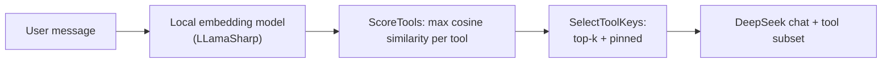

## Tool routing with embeddings and exemplars

**Idea:** Before you call the chat model with tools, you **pre-filter** which tools it may see. A **small local embedding model** scores how close the user message is to short **exemplar phrases** per tool (typical intents). You keep only the top-k tools (and optionally **always-include** tools), then run the normal tool-calling loop with the chat model.

---

### Motivation: why not give the LLM every tool every time?

Imagine an IT helpdesk agent with 12 tools today that grows to 80 tools next quarter:

- **Context cost:** Each tool ships a name, description, and JSON schema into the prompt. 80 tools can add thousands of tokens of noise per request.
- **Wrong-tool calls:** Large catalogs increase the chance the model picks a plausible but incorrect function.
- **Latency:** Smaller tool payloads can mean faster first-token behaviour on some stacks.

Routing is a cheap pre-filter. The chat model still decides **arguments** and **when** to call.

---

### Flow



The two routing steps are deliberately separate methods so each is easy to inspect and test independently.

Use the **same** embedding checkpoint for queries and exemplars. Mixing models breaks similarity.

---

### Scoring exemplars

Each tool has several exemplar strings. The score for a tool is the **maximum** cosine similarity between the query and any of that tool's exemplars. Max beats mean: a single strong exemplar match keeps a tool competitive even if the others miss.

**Good exemplars are not copies of user text.** In production you collect paraphrases, support tickets, and FAQ variants. If your exemplars are near-identical to live queries, routing looks "magic" but you are not testing generalization — and you will overfit to one phrasing.

---

### Failure modes

1. **Recall failure:** The right tool scores below the cut. The assistant may refuse or hallucinate.
2. **Exemplar gap:** User wording is unlike every stored phrase (domain jargon, typos, different language).
3. **Multi-intent, k too small:** One message needs two tools but k=1 only surfaces the dominant cluster. *Demo case 5 shows this deliberately.*
4. **False positives:** Two unrelated tools share vague wording ("check", "status", "connection").

**Mitigations:**
- More / better exemplars covering edge phrasings
- Higher k (with diminishing returns as catalog noise re-enters)
- **Always-include sets** for critical tools (compliance, logging, safety) that must always be in scope
- Hybrid keyword rules as a fast pre-pass
- A second-stage **reranker** for precision over a shortlist

---

### Always-include: pinning tools regardless of score

Some tools should always be in scope:

- A **compliance tool** that every interaction must offer (e.g. `createSupportTicket`)
- A **safety tool** that must run whenever certain topics appear
- A **context tool** the agent needs for every turn (e.g. `getUserProfile`)

Pinned tools are merged into the set **after** retrieval so they do not consume a retrieval slot. Demo case 6 shows this: k=1 retrieves only the VPN tool, but `getUserAccount` is pinned, so both are available.

---

### Which embedding model?

For the C# port, the example uses LLamaSharp with a local GGUF embedding model. The default path is `models/bge-small-en-v1.5-q8_0.gguf`. It is small, English-oriented, and works well with LLamaSharp's `LLamaEmbedder`.

Alternatives: a lighter quantization of the same family for lower RAM; a **multilingual** embedding GGUF if user intents are not English — still always use one model for both exemplars and queries.

---

### Chat stack detail (DeepSeek + tools)

The chat model is DeepSeek V4 Flash accessed through the OpenAI .NET SDK. Tool definitions are passed via `ChatCompletionOptions.Tools`, and the agent loop handles tool calls with `ChatMessage.CreateToolMessage`.

---

### Core takeaway

Tool routing is **RAG for tools**: exemplars are documents, the user message is the query, and cosine similarity is retrieval. It does not replace careful tool design or the chat model's judgment — but it scales agent catalogs the same way retrieval scales knowledge bases.

```text
Without routing:  12 tools → 12 schemas in prompt (fine)
                  80 tools → 80 schemas in prompt (noisy, expensive)
                 500 tools → impractical

With routing:     500 tools, k=4 → only 4 schemas in prompt every time
```
